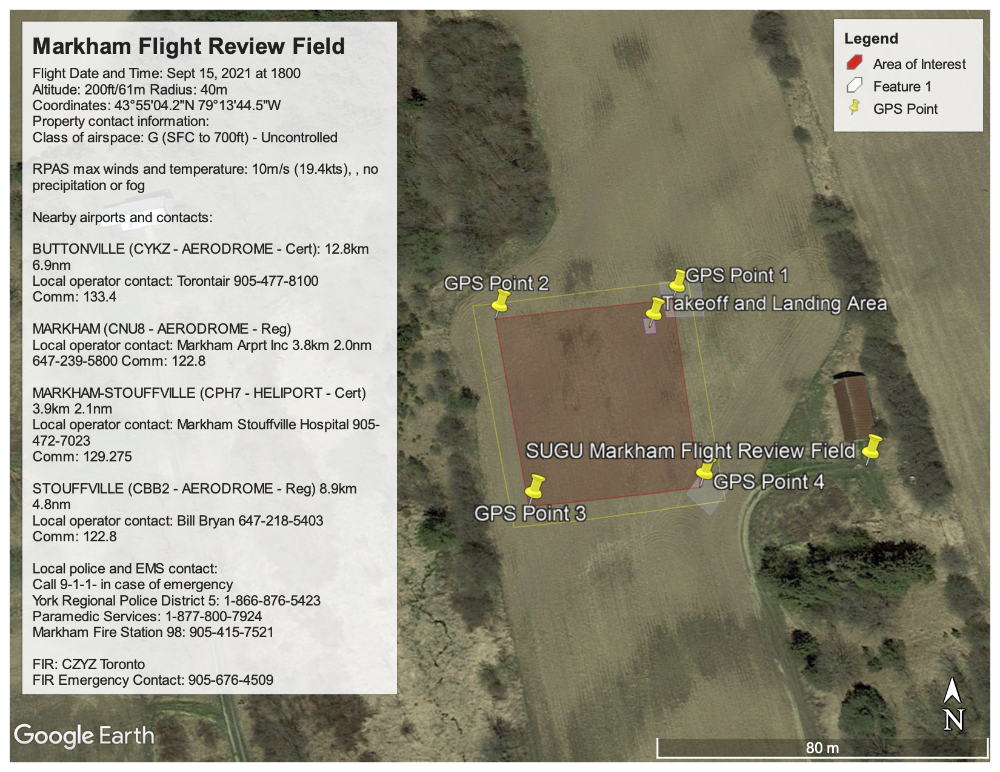
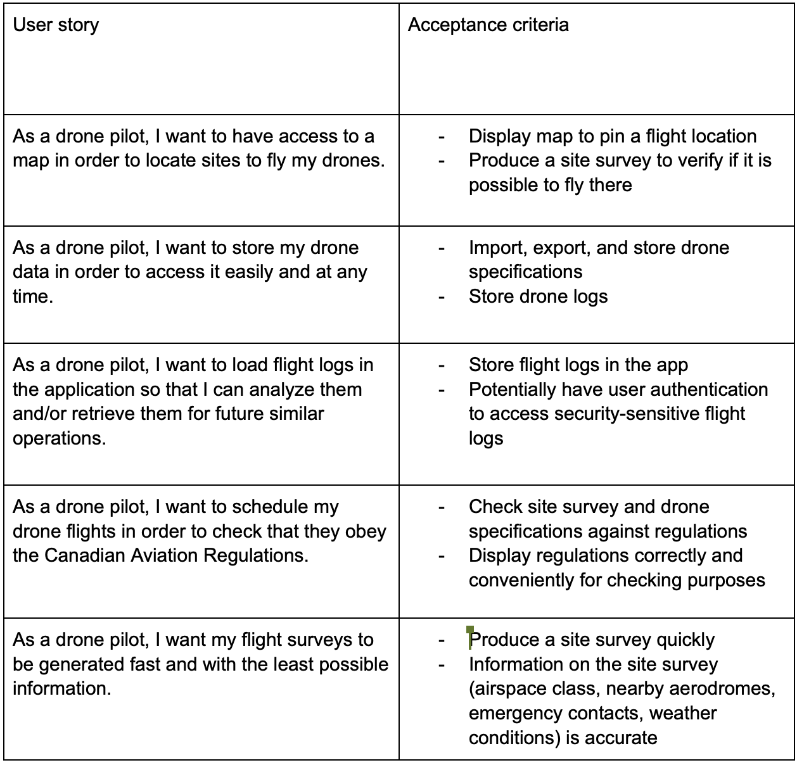
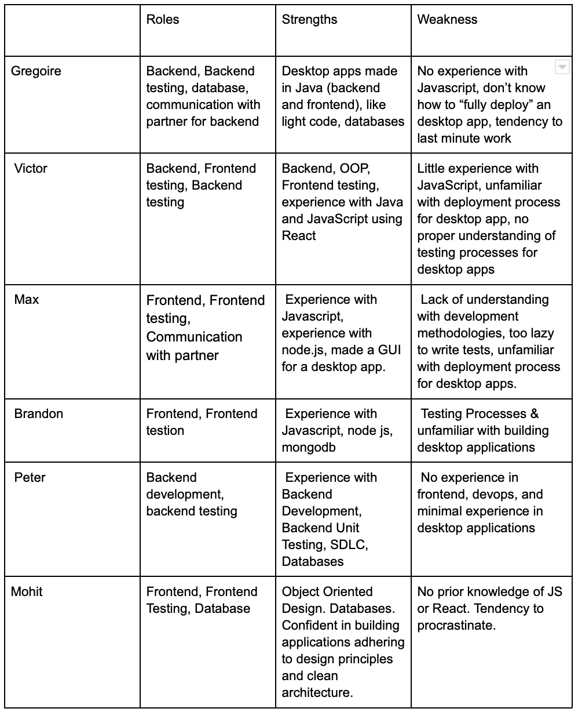

# b00lean b0ys - Aeromap

## Product Details
 
#### Q1: What are you planning to build?

In June 2019, Transport Canada introduced new aviation laws around drone flight, treating drones similar to conventional aircrafts and as a result outlines several different forms of documentation required to plan drone flights.
We are planning to build a Windows desktop application used by the UofT Aerospace Team to plan/schedule drone flights. The main functionality of the app is to provide the user a way to find sites that, according to the Canadian Aviation Regulations, allow drone flights. The user is provided a map feature that, given a pinned location, gathers information about related or sensitive surrounding areas (such as airports, hospitals), class of airspace, and weather conditions combined with the given drone specifications to check whether or not a drone flight can be operated at this given location. In case of “success”, a site survey can be exported in a PDF format for the drone pilot’s use. The user can store information about its drones and flight logs (pictures taken by the drone). The application only interacts with the drone pilot and not with the drone itself. Attached is an example site survey, with displayed info manually sought out by the Aerospace team. The app will provide a shortcut into gathering these resources and quickly produce an accurate site survey.

A site survey looks like that:

Features:
    * Drag across a visual map and drop a pin on specific locations to view the site survey information (airspace classes, nearby aerodromes, weather conditions)
    * Draw a boundary around flight area, and a safety margin around the boundary
    * Sidebar for drone specifications
    * Prompt to remind team to take pictures for logs and fill logs by hand
    * Save drone/flight information in the map on local files

#### Q2: Who are your target users?

  > The target users are members of the UofT Aerospace Team (mainly Mechanical Engineering students).

#### Q3: Why would your users choose your product? What are they using today to solve their problem/need?

Today, our users plan drone flights manually. Flight surveys are written with a text editor and the graphical representation of the site area is made with screenshots and image editors. The drone pilot has to scrupulously study the site’s surroundings to get information about nearby airports/aerodromes and then, for each of these, get contact information. This is a tedious (and time-consuming) procedure that pilots have to do before each flight. We aim to automate the process (given coordinates on the map and drone data) so that the user can save (a lot of) time (once the site location is known, the site survey is made instantaneously). Additionally, it avoids missing crucial information (a human eye can easily miss a nearby aerodrome) and ensures accurate data (contact information for a given airport is going to be accurate). This application is unique because it serves the purpose of the Uoft Aerospace Team only. Because of its tailor-made nature, the app will undoubtedly align with the partner’s expectations.

#### Q4: How will you build it?

    |               |     Frontend     |     Backend     |
    |---------------|------------------|-----------------|
    |   Language    |   JavaScript     |    JavaScript   |   
    |---------------|------------------|-----------------| 
    | Libraries,    |     React        |   Node.js (for  |
    | Frameworks    |                  |     database)   | 
    |---------------|------------------|-----------------|
    | External APis | Google Maps API  |                 |
    |               | ICAO API         |                 |
    |               | AVWX API         |                 |

Google Maps API requires to embed a web browser in the application. ICAO API is used to retrieve airspace class, aerodrome information and weather condition. AVWX API is used for weather conditions only.

Deploy: We will package our program using electron-packager and then build a single setup EXE file using InnoSetup, then possibly build a Windows installer for Electron using Squirrel.

Testing strategy: We need to determine features that need to be tested (producing a site survey, storing flight logs, importing / exporting site coordinates, surveys or logs, etc.), and pass or fail criterias (whether or not site survey is accurate, logs are stored indefinitely, etc.). We will document what features we are testing, the testing process (unit test, integration tests), and bugs that we find if any.

Architecture: We will begin with a clean architecture approach and build from there. This will allow us to keep track of dependencies as we lay down the backend of the application. Some of the entities in mind include “user”, “coordinate”, “flight area”, “geofence”, “drone”, “aerodrome”. We will ensure entities are not allowed to directly interact with each other. The use case classes will make use of the entities allowing for various methods that our application will require. Moving outwards, we plan on creating a controller layer that handles all the features of the application by calling appropriate use case methods. Finally we will have a GUI layer that handles all graphical output of the program. The method used to bridge the GUI and the controller layer is still being decided.

#### Q5: What are the user stories that make up the MVP?

----
## Intellectual Property Confidentiality Agreement 

**Briefly describe which option you have agreed to. Your partner cannot ask you to sign any legally binding agreements or documents pertaining to non-disclosure, confidentiality, IP ownership, etc.**

We are free to publish source code, design and software on Github.

----

## Process Details

#### Q6: What are the roles & responsibilities on the team?

#### Q7: What operational events will you have as a team?

We have 2 separate teams: one dedicated to backend and backend testing, the other one to frontend and frontend testing. We will make sure that at least one member of each team will participate to the bi-weekly scheduled meeting with the partner. There is a meeting set up weekly for the whole team during the tutorial (Tuesday, 9pm) so that we can discuss further objectives for both backend and frontend and communicate new APIs if necessary. This meeting will be online for now. Members of the same team will do at least one quick meeting to review/synchronize the parts they are developing concurrently. We plan to fully separate the coding tasks so that we can work independently. If we feel that we lack motivation, we will plan coding sessions. More generally, we use our discord channel to discuss our decisions, if necessary.
 
 
1st meeting description: 
The first meeting consisted of introducing ourselves to the UofT Aerospace Team member in charge of the project, Katrina, and another team member Henry. Katrina briefly explained to us how the Aerospace Team currently works before each drone flight (they have to make a whole site survey and check manually that everything is correct according to the Canadian Aviation Regulations) and presented her expectations for the software. In approximately half an hour, we could get an overview of the main functionalities for the windows desktop application: the user should be able to pin a location on a map and get relevant information about surrounding areas (nearby airports/aerodromes for example), store data about flights and drones. A flight survey should be automatically generated and accurate (this is the key point of the project – users don’t want to do the tedious administrative work). We talked a little bit about tech stack requirements, confidentiality of the data (their drone designs must be kept private for example), and availability for meetings. At the end of the meeting, the goal was for us to process the information we were given in order to produce an overview of what we understand, determine what we might or might not be able to do, and produce a draft of the MVP. 

2nd meeting description:
The second meeting consisted of our team giving Katrina and Ernest - another member of the Aerospace team - a rundown of the feature list that we came up with. The features matched with the required functionalities that they wanted - including producing a site survey according to a pinned location on a map, drawing flight boundaries around the pin, exporting the collected info in a PDF format, storing drone specifications and drone logs. We clarified about the APIs that we could potentially use and the information they wanted in the site survey. We also set a biweekly meeting time of Wednesday 7pm, and agreed on a confidentiality agreement: we are free to publish our source code, software and design on Github. After that, we went through some Figma planning to decide on the flow of the application, fonts, color scheme and other small details.

  
#### Q8: What artifacts will you use to self-organize?

We keep track of what needs to be done with a to-do list (general, to see what classes are done/missing) and scheduled task boards (so that we see the code timeline). Tasks are prioritized depending on the necessity of the task. For example, we will divide each class in 2 parts: “main functionalities” and “details” and make sure the main functionalities of all classes are implemented (and tested) before moving to the details (optimisation of code, etc.). This is to ensure a working MVP, while also keeping in mind the efficiency needed to acquire a valuable product. 
Tasks are assigned to members such that the work is approximately equally spread among the team. We will also take into account workload of team members each week to be most efficient and fair (this is to avoid unnecessary pressure on a team member and also waiting on this same team member to move forward). 
We use 5 states for our work: 1. To be done, 2. In progress (API and structure done), 3. Main functionalities complete, 4. Main functionalities complete and tested, 5. Class complete and tested to help us track the status of our work. A class is considered done once state 4 is reached. 

#### Q9: What are the rules regarding how your team works?

**Communications:**
The methods of communication within the team are a group voice channel and a group text channel, as well as an announcement channel for important information from the course staff/our partner. So far all the group members have been responsive, communicating on a daily basis.

We will communicate with the partner using email and biweekly in a Zoom meeting where progress and feedback will be discussed. 

**Meetings:**
The group members are motivated toward upholding integrity with our client, therefore we do not feel it is necessary to have a moderation system in place as of yet. Evidently, if a team member is not acting responsibly or there is a clear difference in effort, that will show in the reflections at the end of the project. Of course, everyone is expected to speak in the group chat and attend meetings regularly.

**Conflict Resolution:**
Indecisions will be resolved by a group discussion and in general a majority decision. We do not believe there will be any strong enough disagreements such that we will not be able to move forward after one meeting.
 
Non-responsive team members will be resolved through communication and if, as a base guideline, this lasts for up to 2 weeks, the rest of the group will contact course staff to help motivate them or reduce their contribution to the project.

We will prevent unmet deadlines by managing our time effectively and scheduling regular meetings to work on the project with a timeline in mind. We will try to progress with the project such that we can meet our deadlines a few days early, so that testing time is available and we are able to present a confident product to our partner.

----
## Highlights

Initially, we were deciding between a custom project proposal and the aerospace team’s proposal. We liked our own proposal because it contained more interesting features and is an educational app that is relatable to us. However, we eventually went with the aerospace team’s proposal as it is a specialized product and we feel like it is a beneficial experience to work with actual clients.

The aerospace team and us decided to go with a desktop application instead of the traditional website or mobile application options. The aerospace team wanted security for their information so we could not use a cloud hosted database, and storing everything locally on a desktop app is a good solution to that. Additionally, the aerospace team asked for the application to be an one instance app for the whole team, so the desktop app on a team laptop is preferable to mobile apps on everyone’s personal phone.

Based on our strengths and the components of the app that we were willing to work on, a key decision we made was that the team will split into two teams: backend and frontend. Each subteam will be dedicated to their component, and at least one member from each subteam needs to be present in the biweekly meetings with the partner. Additionally, members from each team can collaborate as features will need to communicate between the backend and the frontend, to ensure a supportive and collaborative working environment.

Another key decision made by our group was the tech stack (languages / frameworks) to use when building the application. In our first meeting with the client, we were told that using some python libraries might lead to conflicts with their existing software. Due to this our group began leaning towards java, because many of us were already familiar with the language. Then some of our team members brought up the argument that this could be a great opportunity to learn a new language and build out our technical repertoire in a group setting. Most of us have very little knowledge of javascript or react (as shown in the weaknesses), but our group decided to take a leap of faith and learn on the job. And we are very excited to do so!

## Mockup

Link to figma prototype: https://www.figma.com/file/xJVF6etpbOxCu2rVatLrEh/aeromap?node-id=0%3A1
